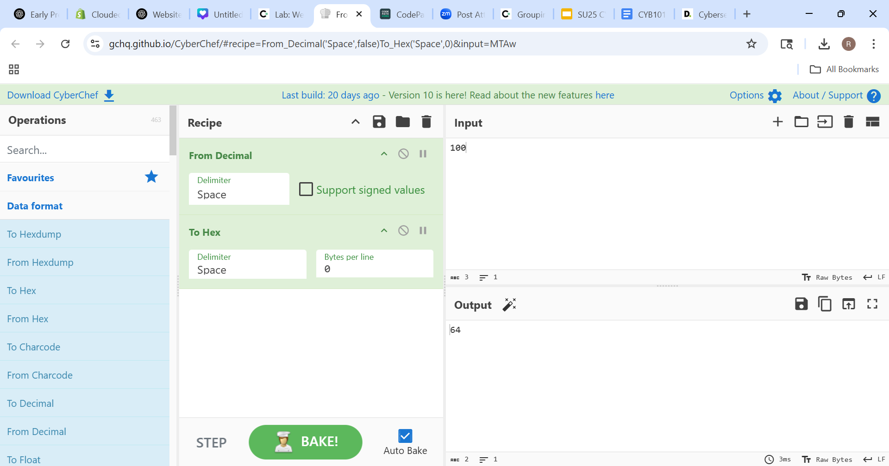
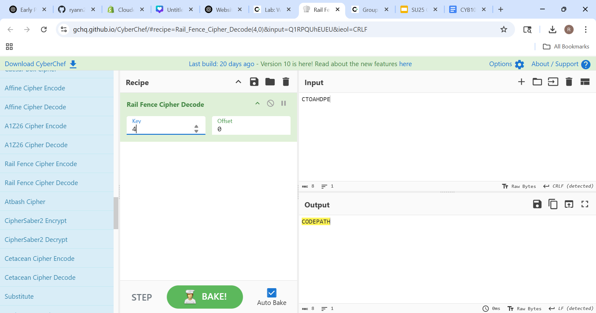
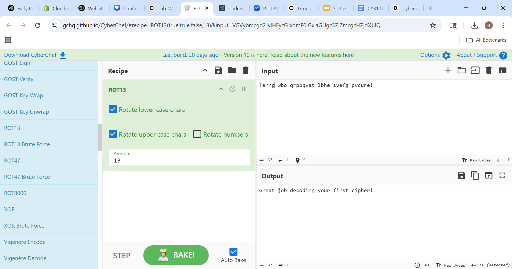
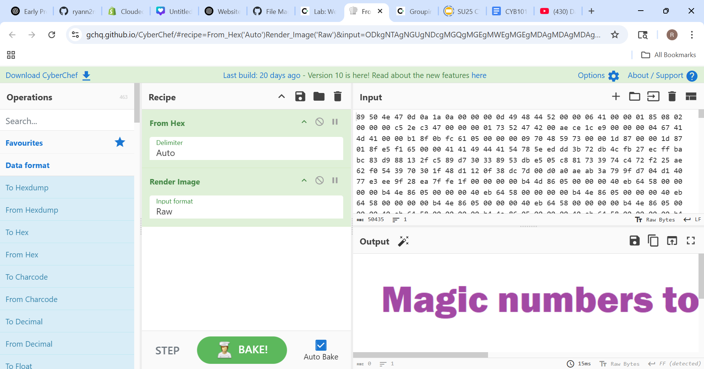
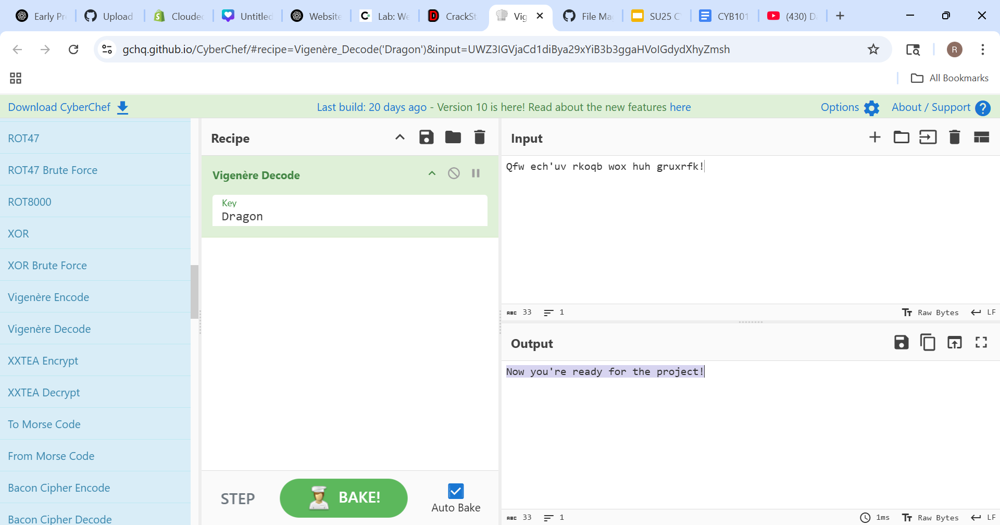

# Week 1 – CyberChef: Encoding, Encryption, and Forensics

---

## 🔐 Exercise 1: ROT13 Decode
**Message:** `Terng wbo qrpbqvat lbhe svefg pvcure!`  
**Result:** `Great job decoding your first cipher!`

---

## 🔐 Exercise 2: Rail Fence & Vigenère
**Scrambled key:** `CTOAHDPE`  
Decoded using Rail Fence → `CODEPATH`

**Message:** `Acx'vt dhppu dqpzbui! Yhie im br!`  
**Result:** `You're doing amazing! Keep it up!`

---

## 🔐 Exercise 3: ROT13
**Message:** `Ijhtinsl rjxxfljx nx kzs, gzy bmfy jqxj hfs bj it?!`  
**Result:** `Decoding messages is fun, but what else can we do?!`

---

## 🧩 Exercise 4: Broken Image Fix
Used CyberChef to repair a broken PNG file using hex editing and magic number replacement.

---

## 🧠 Exercise 5: Hidden Forensics Message
Used color palette tools to uncover the message hidden in an image:  
**Result:** *"I'm Impressed"*

---

## 🧪 Exercise 6: Hash Crack + Vigenère
Used CrackStation to decode the hash:  
**Key:** `Dragon`

**Message:** `Qfw ech'uv rkoqb wox huh gruxrfk!`  
**Result:** `Now you're ready for the project!`

