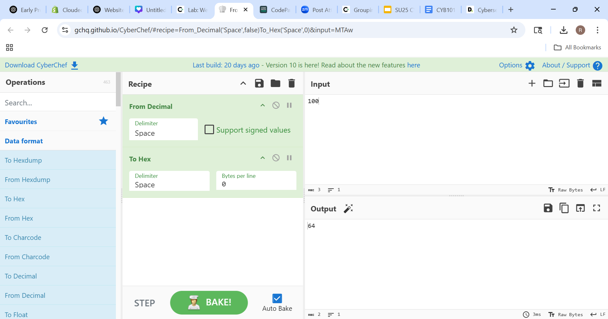
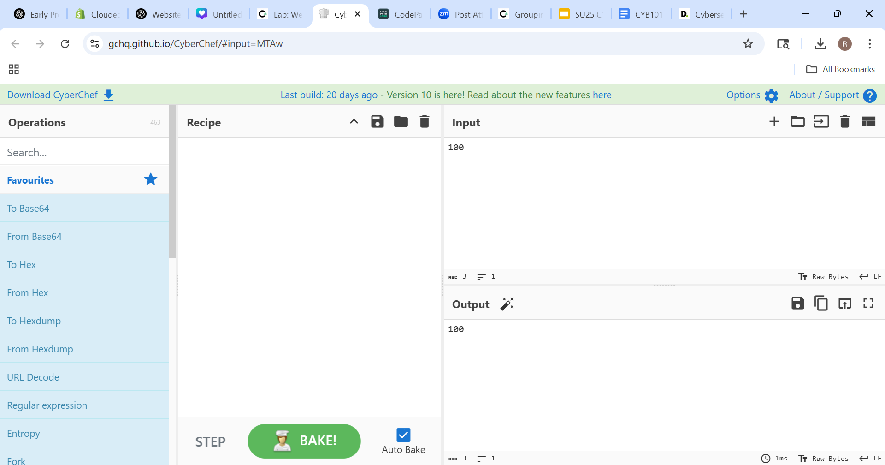
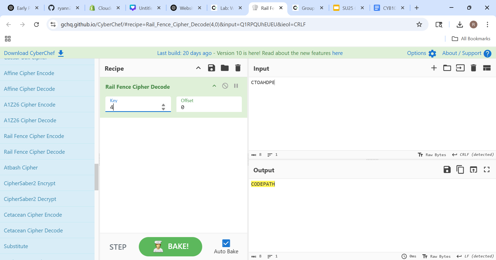
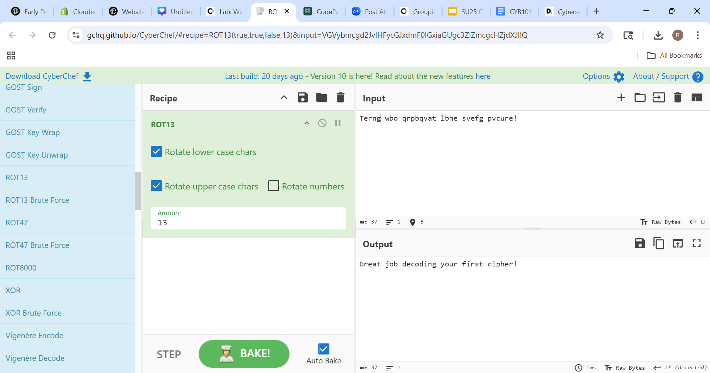
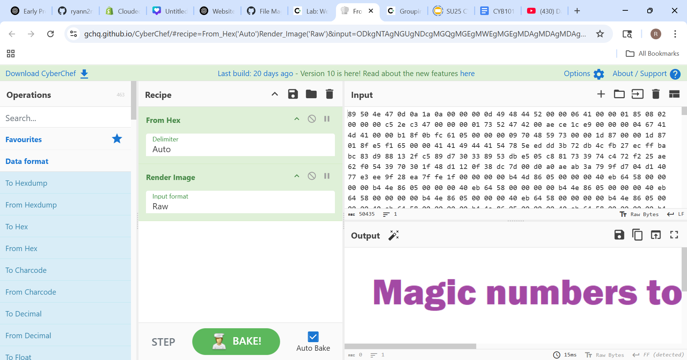
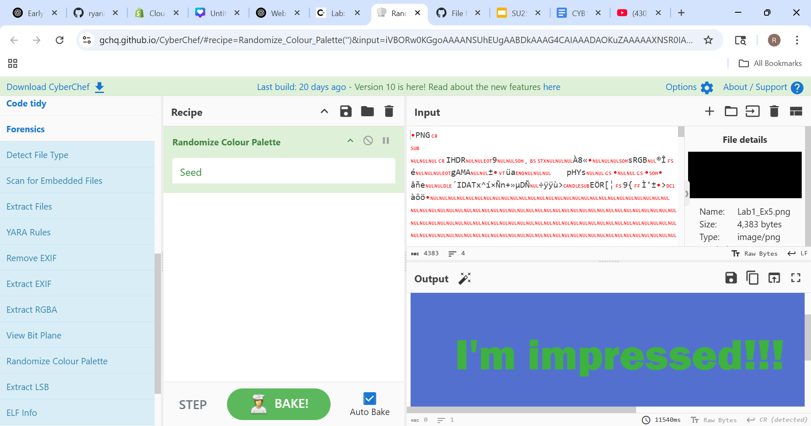

# Week 1 – CyberChef Lab Summary

---

## 🧠 Introduction

In this lab, we explored CyberChef's capabilities like encoding, encryption, decryption, and digital forensics.

---

## 🔐 Exercise 1 – ROT13 Cipher

**Message:** `Terng wbo qrpbqvat lbhe svefg pvcure!`  
**Decoded:** `Great job decoding your first cipher!`

---

## 🔐 Exercise 2 – Rail Fence + Vigenère Cipher

**Scrambled Key:** `CTOAHDPE`  
**Decoded Key:** `CODEPATH` using Rail Fence Cipher  
**Message:** `Acx'vt dhppu dqpzbui! Yhie im br!`  
**Decoded:** `You're doing amazing! Keep it up!`

---

## 🔐 Exercise 3 – ROT13 Practice

**Message:** `Ijhtinsl rjxxfljx nx kzs, gzy bmfy jqxj hfs bj it?!`  
**Decoded:** `Decoding messages is fun, but what else can we do?!`

---

## 🧩 Exercise 4 – Fix a Corrupted Image Header

Used hex tools to restore a PNG image’s header and successfully render it.

---

## 🕵️ Exercise 5 – Hidden Message in an Image

Applied forensics tools and palette tweaks to reveal a hidden message in the image.

**Result:** `"I'm impressed!!!"`

---

## 🧪 Exercise 6 – Vigenère + CrackStation Hash

**Message:** `Qfw ech'uv rkoqb wox huh gruxrfk!`  
**Key (Cracked):** `Dragon`  
**Decoded Message:** `Now you're ready for the project!`

---

Let me know if you'd like me to review or push the full Markdown file to GitHub for you!
